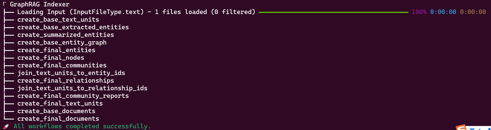
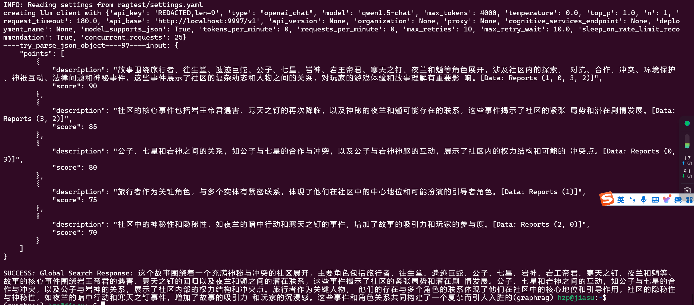

# 简介
一般意义上的graphRAG是指微软发布的graphRAG而不是torch里的graph

微软graphRAG文档地址 https://microsoft.github.io/graphrag/

微软graphRAG仓库地址 https://github.com/microsoft/graphrag

微软的GraphRAG旨在通过结合知识图谱和图机器学习来提升大型语言模型（LLM）在处理私有数据时的性能，它的处理步骤如下，具体如何实现需要啃源码：

1.将源文档分割成文本块。

2.使用大模型从每个文本块中提取图节点和边的实例。

3.使用大模型为每个图元素生成摘要。

4.使用社区检测算法将图划分为社区。

5.使用大模型为每个社区生成摘要。

6.使用社区摘要生成局部答案，然后汇总这些局部答案以生成全局答案。

7.接收用户查询。

8.通过图谱检索相关信息。

9.生成准确、全面的答案。

# 使用步骤和操作说明
## 前提
1.简单介绍一下图结构，这是由点和边组成的一种关系，现在微软的框架是直接使用大模型来提取文本块中的节点和边（即实体和关系），所以这就意味着必须得是一个真正的大模型，它拥有比较强的理解能力，确保能在文本中推理出实体。经过测试，开源的7B及以下的模型其能力不足以支撑提取关系，但是可以针对提取关系进行微调。

2.目前的演示是为了跑通整个graphRAG流程而不是卡在某一个步骤导致无法学习，所以使用的是官方的quick start。在了解了其原理后，我们需要针对性微调两个方向：提取实体关系和根据实体关系给出结论，同时官方给出的prompt是英文的，大模型需要天生支持中英文，后期有了自己的想法后可以自己修改中文prompt，并且修改切分方法以保证不会出现乱码

3. 本操作步骤基于16G及以上显存实现，模型为千问1.5-14b-int4，测试文本是一段原神故事剧情

## 操作步骤
1. 首先启动xinference
    XINFERENCE_MODEL_SRC=modelscope xinference-local --host 0.0.0.0 --port 9997

    启动 bge-base-zh-v1.5 embedding模型

    启动 qwen1.5-chat 语言模型 vllm加载并开启int4量化
2. 创建一个新的conda环境用于启动graphRAG
    conda create -n graphrag python=3.11

    pip install graphrag
    
    找一个自己中意的目录mkdir -p ./ragtest/input

    把提供的文本放到ragtest/input中

    执行graphRAG初始化python -m graphrag.index --init --root ./ragtest

    修改/ragtest目录中的setting.yaml文件，可以参考我给出的setting.yaml文件，我已经删除了所有额外注释，只有在添加了注释的地方要修改
3. 启动graphRAG
    python -m graphrag.index --root ./ragtest
    出现如下界面是成功了
4. 提问
    python -m graphrag.query --root ./ragtest --method global "这个故事讲了什么?"
5. 出现如下界面是成功了

