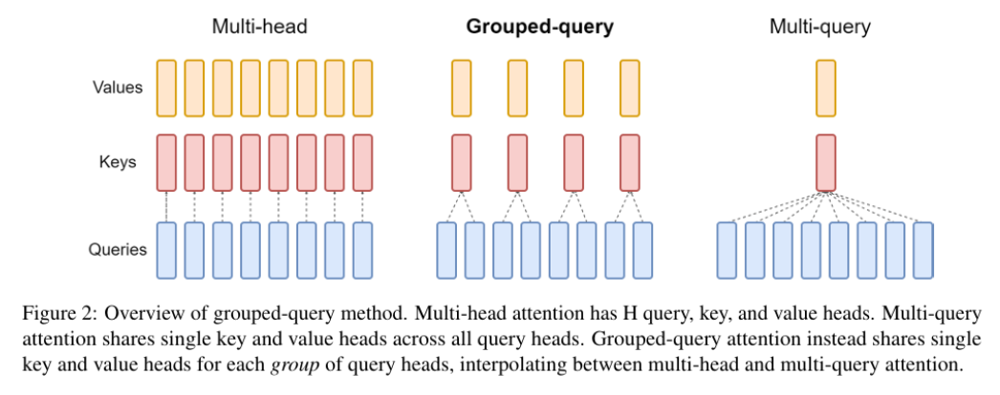

## 讲讲对Attention的理解？
Attention机制是一种在处理时序相关问题的时候常用的技术，主要用于处理序列数据。

核心思想是在处理序列数据时，网络应该更关注输入中的重要部分，而忽略不重要的部分，它通过学习不同部分的权重，将输入的序列中的重要部分显式地加权，从而使得模型可以更好地关注与输出有关的信息。

在序列建模任务中，比如机器翻译、文本摘要、语言理解等，输入序列的不同部分可能具有不同的重要性。传统的循环神经网络（RNN）或卷积神经网络（CNN）在处理整个序列时，难以捕捉到序列中不同位置的重要程度，可能导致信息传递不够高效，特别是在处理长序列时表现更明显。

Attention机制的关键是引入一种机制来动态地计算输入序列中各个位置的权重，从而在每个时间步上，对输入序列的不同部分进行加权求和，得到当前时间步的输出。这样就实现了模型对输入中不同部分的关注度的自适应调整。

## Attention的计算步骤是什么？

具体的计算步骤如下：

- **计算查询（Query）**：查询是当前时间步的输入，用于和序列中其他位置的信息进行比较。
- **计算键（Key）和值（Value）**：键表示序列中其他位置的信息，值是对应位置的表示。键和值用来和查询进行比较。
- **计算注意力权重**：通过将查询和键进行内积运算，然后应用softmax函数，得到注意力权重。这些权重表示了在当前时间步，模型应该关注序列中其他位置的重要程度。
- **加权求和**：根据注意力权重将值进行加权求和，得到当前时间步的输出。

在Transformer中，Self-Attention 被称为"Scaled Dot-Product Attention"，其计算过程如下：

1. 对于输入序列中的每个位置，通过计算其与所有其他位置之间的相似度得分（通常通过点积计算）。
2. 对得分进行缩放处理，以防止梯度爆炸。
3. 将得分用softmax函数转换为注意力权重，以便计算每个位置的加权和。
4. 使用注意力权重对输入序列中的所有位置进行加权求和，得到每个位置的自注意输出。

## self-attention 和 target-attention的区别？

self-attention是指在序列数据中，**将当前位置与其他位置之间的关系建模**。它通过计算每个位置与其他所有位置之间的相关性得分，从而为每个位置分配一个权重。这使得模型能够根据输入序列的不同部分的重要性，自适应地选择要关注的信息。

target-attention则是指将**注意力机制应用于目标（或查询）和一组相关对象之间的关系**。它用于将目标与其他相关对象进行比较，并将注意力分配给与目标最相关的对象。这种类型的注意力通常用于任务如机器翻译中的编码-解码模型，其中需要将源语言的信息对齐到目标语言。

因此，**自注意力主要关注序列内部的关系，而目标注意力则关注目标与其他对象之间的关系**。这两种注意力机制在不同的上下文中起着重要的作用，帮助模型有效地处理序列数据和相关任务。

## 目前主流的attention方法有哪些？
**Multi-Head Attention (MHA)**

从多头注意力的结构图中，貌似这个所谓的**多个头就是指多组线性变换层**，其实并不是，只有使用了一组线性变化层，即三个变换张量对Q，K，V分别进行线性变换，**这些变换不会改变原有张量的尺寸**，因此每个变换矩阵都是方阵，得到输出结果后，多头的作用才开始显现，每个头开始从词义层面分割输出的张量，也就是每个头都想获得一组Q，K，V进行注意力机制的计算，但是句子中的每个词的表示只获得一部分，也就是只分割了最后一维的词嵌入向量。这就是所谓的多头，将每个头的获得的输入送到注意力机制中, 就形成多头注意力机制.

Multi-head attention允许模型**共同关注来自不同位置的不同表示子空间的信息**，如果只有一个attention head，它的平均值会削弱这个信息。

优点:
 - 可以同时捕捉输入数据的不同方面，提高了模型的表达能力。
 - 适合捕捉长距离依赖关系。

缺点:
 - 计算成本较高，因为每个头都需要独立计算键和值矩阵。
 - 内存占用较大，特别是在处理长序列时。

**Multi-Query Attention (MQA)**

MQA的思想其实比较简单，MQA 与 MHA 不同的是，**MQA 让所有的头之间共享同一份 Key 和 Value 矩阵，每个头正常的只单独保留了一份 Query 参数，从而大大减少 Key 和 Value 矩阵的参数量**。

优点:
 - 显著降低了计算成本和内存占用，因为只需要计算一组键和值矩阵。
 - 在某些场景下可以保持较高的性能水平，尤其是在推理阶段。

缺点:
 - 表达能力相对较弱，因为所有头共用相同的键和值矩阵，限制了捕捉不同方面的信息的能力。
 - 可能无法捕捉到某些细微的信息差异。
 - 
**Grouped-Query Attention (GQA)**

GQA 是MQA的一种扩展，它将查询头分成若干组，每组内的查询头共享相同的键和值矩阵。

优点:
 - 继承了MQA的高效性，减少了键和值矩阵的数量，从而降低了计算成本和内存占用。
 - 相比MQA具有更强的表达能力，因为不同组的查询头可以捕捉到输入数据的不同方面。

缺点:
 - 虽然比MQA更为灵活，但在表达能力上仍不如MHA。
 - 实现复杂度稍高，需要对查询头进行分组并分别计算。

## 介绍一下Flash Attention

Flash Attention的主要目的是加速和节省内存，主要贡献包括：

- 计算softmax时候不需要全量input数据，可以分段计算；
- 反向传播的时候，不存储attention matrix，而是只存储softmax归一化的系数。

**为什么这么优化：**

不同硬件模块之间的带宽和存储空间有明显差异，最顶端的是GPU种的`SRAM`，它的容量非常小但是带宽非常大，以A100 GPU为例，它有108个流式多核处理器，每个处理器上的片上SRAM大小只有192KB，因此A100总共的SRAM大小是192KB * 108 = 20MB，但是其吞吐量能高达19TB/s。而A100 GPU `HBM`（High Bandwidth Memory也就是我们常说的GPU显存大小）大小在40GB\~80GB左右，但是带宽只与1.5TB/s。

**核心逻辑：**

分块技术
 - 分块：将输入序列分割成多个块，每个块内部进行自我注意计算。
 - 局部注意力：每个块只与自身及相邻块进行交互，这样可以减少显存中的数据交换。

稀疏矩阵乘法

 - 稀疏化：通过局部注意力和跨块注意力的限制，使得注意力矩阵变得稀疏。
 - 优化计算：利用稀疏矩阵乘法的特性来减少不必要的计算。

**算法流程：**
1. 查询、键和值的投影：
将输入序列通过线性变换分别得到查询（Queries）、键（Keys）和值（Values）矩阵。
2. 分块：
将查询、键和值矩阵分割成多个块。
每个块的大小通常是固定的，例如在实践中可以是512或1024个token。
3. 局部注意力计算：
对于每个块，计算块内部的注意力得分。 这一步骤类似于传统的自我注意计算，但只限于当前块内的元素。
4. 跨块注意力计算：
允许每个块与相邻块之间的交互。 通过限制交互范围，减少计算量。
5. 结果合并：
将各个块的结果合并起来，得到最终的注意力输出。

## Transformer为何使用多头注意力机制？为什么不使用一个头？
多头保证了transformer可以注意到不同子空间的信息，捕捉到更加丰富的特征信息。可以类比CNN中同时使用**多个滤波器**的作用，直观上讲，多头的注意力**有助于网络捕捉到更丰富的特征/信息。**

## Transformer为什么Q和K使用不同的权重矩阵生成，为何不能使用同一个值进行自身的点乘？
 - 使用Q/K/V不相同可以保证在不同空间进行投影，增强了表达能力，提高了泛化能力。
 - 由于softmax函数的性质，得到的向量接近一个one-hot向量（接近程度根据这组数的数量级有所不同）。如果令Q=K，那么得到的模型大概率会得到一个类似单位矩阵的attention矩阵，**这样self-attention就退化成一个point-wise线性映射**。这样至少是违反了设计的初衷。

## Transformer计算attention的时候为何选择点乘而不是加法？两者计算复杂度和效果上有什么区别？
 - K和Q的点乘是为了得到一个attention score 矩阵，用来对V进行提纯。K和Q使用了不同的W\_k, W\_Q来计算，可以理解为是在不同空间上的投影。正因为有了这种不同空间的投影，增加了表达能力，这样计算得到的attention score矩阵的泛化能力更高。
 - 为了计算更快。矩阵加法在加法这一块的计算量确实简单，但是作为一个整体计算attention的时候相当于一个隐层，整体计算量和点积相似。在效果上来说，从实验分析，两者的效果和dk相关，dk越大，加法的效果越显著。
## 为什么在进行softmax之前需要对attention进行scaled（为什么除以dk的平方根）
- 这取决于softmax函数的特性，如果softmax内计算的数数量级太大，会输出近似one-hot编码的形式，导致梯度消失的问题，所以需要scale
 - 那么至于为什么需要用维度开根号，假设向量q，k满足各分量独立同分布，均值为0，方差为1，那么qk点积均值为0，方差为dk，从统计学计算，若果让qk点积的方差控制在1，需要将其除以dk的平方根，是的softmax更加平滑
## 为什么在进行多头注意力的时候需要对每个head进行降维？
 - 将原有的**高维空间转化为多个低维空间**并再最后进行拼接，形成同样维度的输出，借此丰富特性信息
 - 基本结构：Embedding + Position Embedding，Self-Attention，Add + LN，FN，Add + LN
## 为何在获取输入词向量之后需要对矩阵乘以embedding size的开方？意义是什么？
embedding matrix的初始化方式是xavier init，这种方式的方差是1/embedding size，因此乘以embedding size的开方使得embedding matrix的方差是1，在这个scale下可能更有利于embedding matrix的收敛。