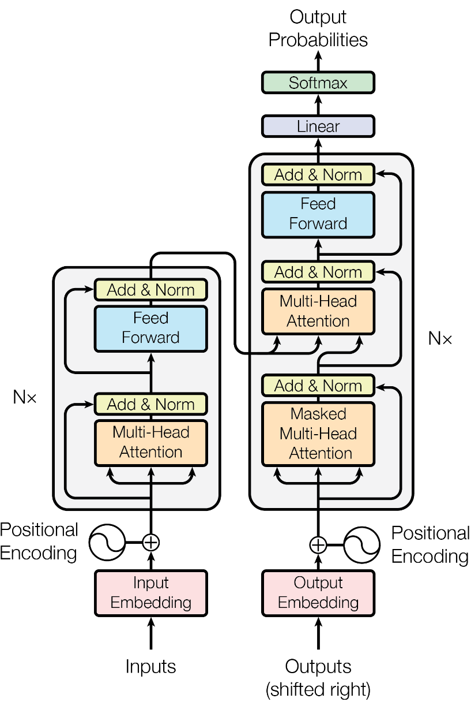
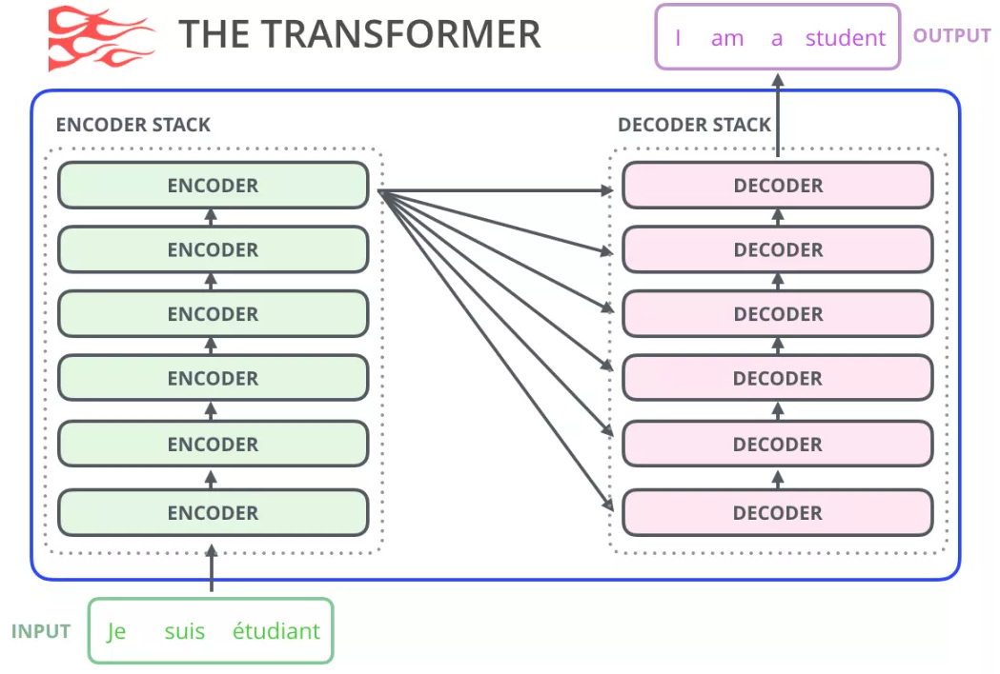
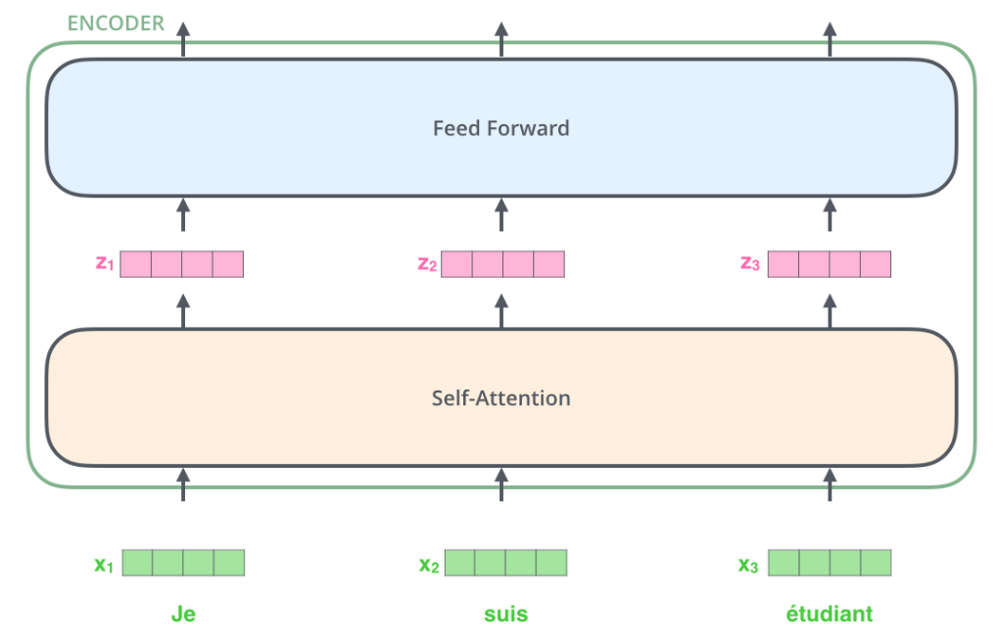
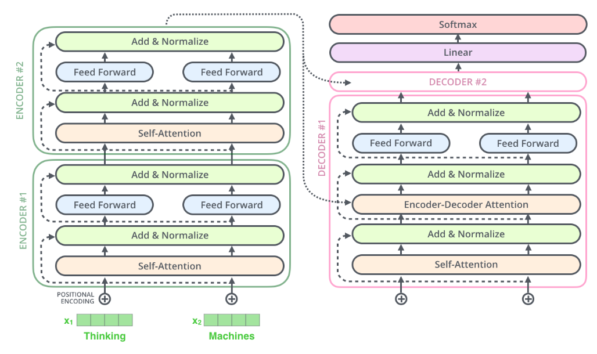
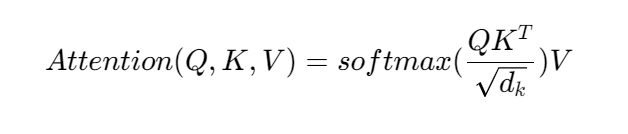

## transformer架构是怎样的？最初是为什么提出的？
架构如下两图所示：


Transformer模型最初是在2017年的论文《Attention is All You Need》中提出的。它主要是为了解决传统序列到序列（seq2seq）模型在处理长距离依赖和并行计算方面的限制。

在Transformer出现之前，序列到序列任务（如机器翻译）通常使用的是基于循环神经网络（RNN）或长短期记忆网络（LSTM）的架构。这些模型虽然能够很好地捕获序列中的上下文信息，但存在以下问题：

 - 长距离依赖问题：随着序列长度的增加，RNN和LSTM模型难以有效地传递信息，尤其是在处理长距离依赖关系时，容易出现梯度消失或梯度爆炸的问题。
 - 训练效率低：由于RNN和LSTM需要逐个元素地处理序列数据，这导致了模型训练过程中的串行依赖，使得并行化计算变得困难，从而影响了训练的速度和效率。

为了解决这些问题，Transformer模型引入了几项创新：

 - 自注意力机制（Self-Attention）：允许模型在每一步都能够对输入序列的不同部分进行关注，从而能够有效处理长距离依赖关系，而不必依赖于RNN的递归结构。
并行化操作：由于自注意力机制可以在整个序列上并行计算，这极大地提高了模型的训练速度。
 - 位置编码：为了弥补自注意力机制不能自动获得序列位置信息的缺点，Transformer在输入序列中添加了位置编码，这样模型就能够区分序列中不同位置的词。
因此，Transformer模型不仅提高了处理长序列的能力，还显著减少了训练时间，成为自然语言处理（NLP）领域的重要里程碑，并广泛应用于机器翻译、文本摘要、语音识别等多个场景。

## Transformer各个模块的作用
**（1）Encoder模块**

- 经典的Transformer架构中的Encoder模块包含6个Encoder Block
- 每个Encoder Block包含两个⼦模块, 分别是多头⾃注意⼒层, 和前馈全连接层
  - 多头⾃注意⼒层采⽤的是⼀种Scaled Dot-Product Attention的计算⽅式, 实验结果表  明, Multi-head可以在更细致的层⾯上提取不同head的特征, ⽐单⼀head提取特征的效果更佳
  - 前馈全连接层是由两个全连接层组成, 线性变换中间增添⼀个Relu激活函数, 具体的 维度采⽤4倍关系, 即多头⾃注意⼒的d_model=512, 则层内的变换维度d_ff=2048

**（2）Decoder模块**

- 经典的Transformer架构中的Decoder模块包含6个Decoder Block
- 每个Decoder Block包含3个⼦模块, 分别是多头⾃注意⼒层, Encoder-Decoder Attention  层, 和前馈全连接层
  - 多头⾃注意⼒层采⽤和Encoder模块⼀样的Scaled Dot-Product Attention的计算⽅  式, 最⼤的 区别在于**需要添加look-ahead-mask,** 即遮掩"未来的信息"
  - Encoder-Decoder Attention层和上⼀层多头⾃注意⼒层最主要的区别在于Q != K = V,  矩阵Q来源于上⼀层Decoder Block的输出, 同时K, V来源于Encoder端的输出
  - 前馈全连接层和Encoder中完全⼀样

**（3）Add & Norm模块**

- Add & Norm模块接在每⼀个Encoder Block和Decoder Block中的每⼀个⼦层的后⾯
- 对于每⼀个Encoder Block, ⾥⾯的两个⼦层后⾯都有Add & Norm
- 对于每⼀个Decoder Block, ⾥⾯的三个⼦层后⾯都有Add & Norm
- Add表示残差连接, 作⽤是为了将信息⽆损耗的传递的更深, 来增强模型的拟合能⼒
- Norm表示LayerNorm, 层级别的数值标准化操作, 作⽤是防⽌参数过⼤过⼩导致的学习过程异常,模型收敛特别慢的问题

**（4）位置编码器Positional Encoding**

- Transformer中采⽤三⻆函数来计算位置编码
- 因为三⻆函数是周期性函数, 不受序列⻓度的限制, ⽽且这种计算⽅式可以对序列中不同位置的编码的重要程度同等看待

## Decoder端训练和预测的输入
1. 在Transformer结构中的Decoder模块的输⼊, 区分于不同的Block, 最底层的Block输⼊有其特殊的地⽅。第⼆层到第六层的输⼊⼀致, 都是上⼀层的输出和Encoder的输出。
2. 最底层的Block在**训练阶段**, 每⼀个time step的输⼊是上⼀个time step的输⼊加上真实标签序列向后移⼀位. 具体来看, 就是每⼀个time step的输⼊序列会越来越⻓, 不断的将之前的输⼊融合进来
   ```text
   假设现在的真实标签序列等于"How are you?", 
   当time step=1时, 输⼊张量为⼀个特殊的token, ⽐如"SOS"; 
   当time step=2时, 输⼊张量为"SOS How"; 
   当time step=3时, 输⼊张量为"SOS How are";
   以此类推...
   ```
3. 最底层的Block在**训练阶段**, 真实的代码实现中, 采⽤的是MASK机制来模拟输⼊序列不断添加的过程
4. 最底层的Block在**预测阶段**, 每⼀个time step的输⼊是从time step=0开始, ⼀直到上⼀个time step的预测值的累积拼接张量. 具体来看, 也是随着每⼀个time step的输⼊序列会越来越长. 相⽐于训练阶段最⼤的不同是这⾥不断拼接进来的token是每⼀个time step的预测值,⽽不是训练阶段每⼀个time step取得的值
   ```纯文本
   当time step=1时, 输⼊的input_tensor="SOS", 预测出来的输出值是output_tensor="What";
   当time step=2时, 输⼊的input_tensor="SOS What", 预测出来的输出值是output_tensor="is";
   当time step=3时, 输⼊的input_tensor="SOS What is", 预测出来的输出值是output_tensor="the";
   当time step=4时, 输⼊的input_tensor="SOS What is the", 预测出来的输出值是output_tensor="matter";
   当time step=5时, 输⼊的input_tensor="SOS What is the matter", 预测出来的输出值是output_tensor="?";
   当time step=6时, 输⼊的input_tensor="SOS What is the matter ?", 预测出来的输出值是output_tensor="EOS", 代表句⼦的结束符, 说明解码结束, 预测结束.
   ```
   
## Transformer是怎么并行化的？
**（1）Encoder并行化**

1. 上图最底层绿⾊的部分, 整个序列所有的token可以并⾏的进⾏Embedding操作, 这⼀层的处理是没有依赖关系的
2. 上图第⼆层⼟⻩⾊的部分, 也就是Transformer中最重要的self-attention部分, 这⾥对于任意⼀个单词⽐如x1, 要计算x1对于其他所有token的注意⼒分布, 得到z1. 这个过程是具有依赖性的, 必须等到序列中所有的单词完成Embedding才可以进⾏。因此这⼀步是不能并⾏处理的。 但是从另⼀个⻆度看, 我们真实计算注意⼒分布的时候, 采⽤的都是矩阵运算, 也就是可以⼀次性的计算出所有token的注意⼒张量, 从这个⻆度看也算是实现了并行, 只是矩阵运算的"并行"和词嵌⼊的"并行"概念上不同⽽已
3. 上图第三层蓝⾊的部分, 也就是前馈全连接层, 对于不同的向量z之间也是没有依赖关系的, 所以这⼀层是可以实现并行化处理的. 也就是所有的向量z输⼊Feed Forward⽹络的计算可以同步进⾏, 互不⼲扰

**（2）Decoder的并行化**

1. Decoder模块在训练阶段采用了并行化处理。 其中Self-Attention和Encoder-Decoder Attention两个子层的并行化也是在进行矩阵乘法, 和Encoder的理解是一致的. 在进行Embedding和Feed Forward的处理时, 因为各个token之间没有依赖关系, 所以也是可以完全并行化处理的, 这里和Encoder的理解也是一致的.
2. Decoder模块在预测阶段基本上不认为采用了并行化处理. 因为第一个time step的输入只是一个"SOS", 后续每一个time step的输入也只是依次添加之前所有的预测token.
3. **注意:** 最重要的区别是训练阶段目标文本如果有20个token, 在训练过程中是一次性的输入给Decoder端, 可以做到一些子层的并行化处理. 但是在预测阶段, 如果预测的结果语句总共有20个token, 则需要重复处理20次循环的过程, 每次的输入添加进去一个token, 每次的输入序列比上一次多一个token, 所以不认为是并行处理.

## 介绍一下你对位置编码的理解
attention机制的公式如下：

从公式中可以看出每一个位置i的查询向量qi，它会与所有位置j的键向量kj计算点积，如果我们交换输入序列中的两个词，只要它们的内容不变，自注意力机制就会产生相同的输出。为了让模型能够具备时序建模的能力需要将位置信息编码到输入序列中，这就是位置编码。
## 介绍一下外推的概念和几种实现方式
大语言模型在处理文本时通常会遇到输入长度限制。这是因为训练这些模型时，为了计算效率和内存使用考虑，序列长度通常会被限定在一个固定的最大值上（例如2048个或4096个令牌）。然而，在实际应用中，我们可能会遇到需要理解和生成更长文本的情况，这就需要采用一些技术来“外推”模型的能力到超过其原始设计的上下文长度。

为了解决这个问题，有以下几种解决方式：
1. 滑动窗口法：
 - 原理：将长文本分割成多个较短的片段，每个片段与前一个片段有一定重叠部分，然后分别送入模型进行处理。
 - 优点：能够保留一定程度的上下文连贯性。
 - 缺点：可能丢失全局信息，特别是对于依赖于远距离依赖的任务效果不佳。
2. 总结与扩展法：
 - 原理：首先使用模型对长文本进行总结，提取关键信息；然后基于这些关键信息生成输出。
 - 优点：能够聚焦于文本中的重要部分。
 - 缺点：可能会遗漏细节信息。
3. 注意力机制增强：
 - 原理：通过对模型的注意力机制进行修改或增强，使其能够在处理每个片段时更好地利用之前片段的信息。
 - 优点：有助于保持上下文的一致性和连贯性。
 - 缺点：可能需要对模型架构进行较大的调整。
4. 长期记忆机制：
 - 原理：为模型增加额外的记忆组件，如外部存储器或专门的长期记忆模块，以帮助模型记住更长序列的信息。
 - 优点：能够有效处理长序列数据。
 - 缺点：增加了模型复杂度，可能影响训练效率。
## token和参数量的关系
预训练模型表现强依赖于模型参数量、token数量和训练总计算量。参数量和token数量的关系总体上是线性的。对于一个较大的模型，必须要有足够的语料来训练，否则模型会过拟合导致性能下降。在实际应用中，我们可以通过减少模型参数量、增加token数量、少次数训练等方式来提升模型性能。同时需要注意，即便是很高质量的数据也不能缓解过拟合问题。
## 预训练时应当注意的问题

## 解码参数的作用

## 介绍一下glm系模型的特点
glm4官方地址：https://github.com/THUDM/GLM-4
## 介绍一下qwen系模型的特点
分词器：采用了基于字节级字节对编码的相同分词器

单模型：
 - 采用了分组查询注意力
 - 为了扩大Qwen2的上下文窗口，实现了双块注意力（DCA，An等人，2024），它将长序列分割成可管理长度的块。如果输入可以在一个块中处理，DCA会产生与原始注意力相同的结果。否则，DCA有助于在块内外的token之间有效地捕获相对位置信息，从而提高长上下文性能。此外，还采用了YARN（Peng等人，2023）来重新调整注意力权重，以更好地进行长度外推。
 - 沿用了Qwen的SwiGLU（Dauphin等人，2017）用于激活，旋转位置嵌入（RoPE，Su等人，2024）用于位置嵌入，QKV偏置（Su，2023）用于注意力，RMSNorm（Jiang等人，2023b）和预归一化用于训练稳定性 
 中文报告地址：https://zhuanlan.zhihu.com/p/709428986
## 介绍一下llama系模型的特点
